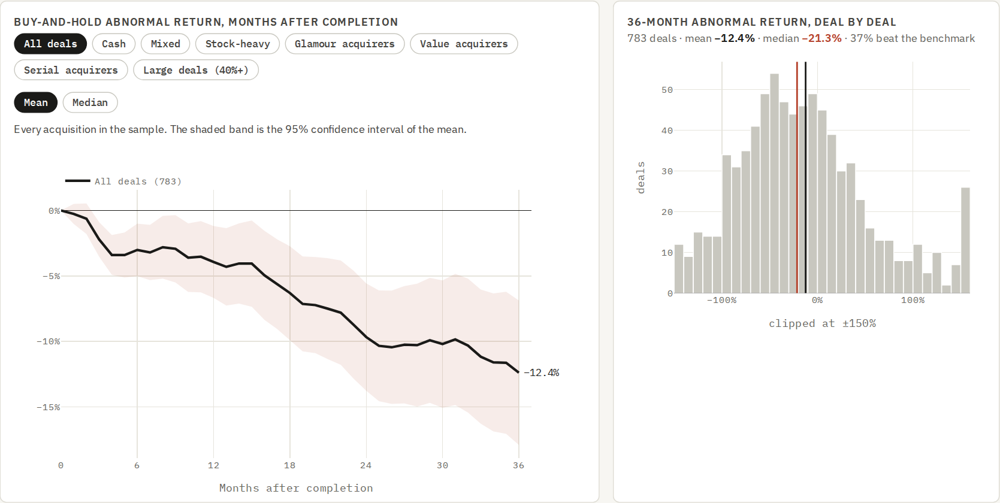
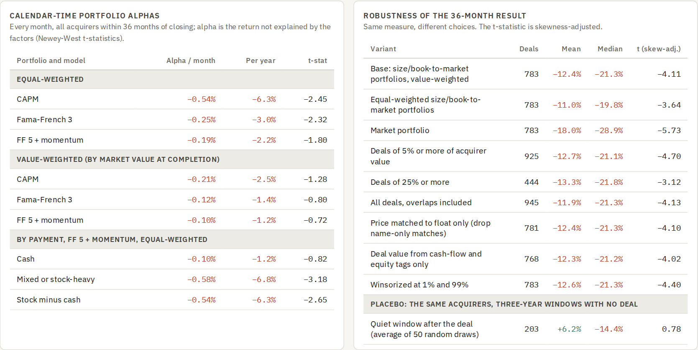
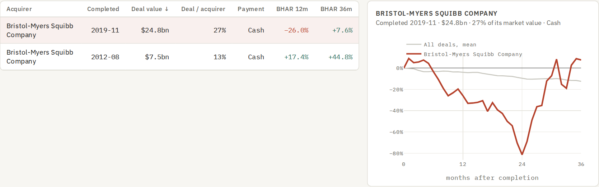

# Does M&A Create Value? A Long-Run Performance Study

**Author:** Alessandro Radice · M.Sc. Economics and Business Law (Finance), Università Cattolica del Sacro Cuore, Milan

**Live page:** [alessandroradice.github.io/Mergers-and-acquisitions-long-run-performance](https://alessandroradice.github.io/Mergers-and-acquisitions-long-run-performance/)

**April 2025. A board is weighing a large acquisition. Announcement-day returns say what investors expect a deal to do; this project measures what actually happened afterwards. Across a decade of US deals, did acquirers beat comparable stocks over the following three to five years, does any shortfall survive a risk adjustment, which kinds of deal did worse, and do margins and goodwill tell the same story?**

An event study of **786 significant acquisitions** completed by US listed non-financial companies from 2012 to 2021, each worth at least $100m and 10% of the acquirer's market value, rebuilt entirely from public data as available on 31 March 2025: deal values from SEC XBRL filings, completion dates from 8-K Item 2.01 reports, monthly total returns including delisted stocks, and Fama-French benchmarks. The main output is an **interactive web page** with every deal; it comes with a Colab notebook, an **Excel model with live formulas**, a 17-page working paper, an executive memo and a presentation deck.



---

## Objective

Most merger analysis stops at the announcement. This project asks the question a board should ask before signing:

1. **What did shareholders earn?** Buy-and-hold abnormal returns (BHAR) against 25 size and book-to-market portfolios, one to five years after completion.
2. **Is it the deal or the acquirer?** Calendar-time portfolio regressions on the Fama-French five factors plus momentum, which handle overlapping deals and risk exposures.
3. **Which deals did worse, and did the synergies show up?** Sorts and regressions on payment, valuation, size, run-up, serial buying and goodwill; industry-adjusted operating returns and goodwill impairments.

---

## Key results

**Event time: acquirers fall behind** (value-weighted size and book-to-market benchmark, dividends included)

| Horizon | Deals | Mean BHAR | Median BHAR | Beat benchmark | t (skewness-adjusted) |
|---|---|---|---|---|---|
| 12 months | 783 | −3.9% | −6.4% | 43% | −2.76 |
| 24 months | 783 | −9.7% | −15.8% | 38% | −4.52 |
| 36 months | 783 | −12.4% | −21.3% | 37% | −4.11 |
| 60 months | 641 | −18.6% | −38.6% | 32% | −2.36 |

**Calendar time: most of the gap is the acquirer, not the deal** (five factors + momentum, alpha per month, Newey-West t)

| Portfolio | Alpha / month | t | Reading |
|---|---|---|---|
| All acquirers, equal-weighted | −0.19% | −1.80 | significant only at 10% |
| All acquirers, value-weighted | −0.10% | −0.72 | not statistically significant |
| Paid in cash | −0.10% | −0.82 | not statistically significant |
| Paid partly or mostly in stock | −0.58% | −3.18 | significant at 1% |
| Stock minus cash | −0.54% | −2.65 | significant at 1% |

- **The base rate is negative.** Three years after completion the average acquirer trailed comparable stocks by 12.4% and only 37% were ahead. The result holds across 9 sample and benchmark variations (means from −18.0% to −11.0%).
- **Risk adjustment shrinks it.** Acquirers are high-beta (1.14), smaller and low-momentum stocks, which lagged over the period anyway. After five factors and momentum the average shortfall is about 2% a year equal-weighted (significant only at 10%) and not statistically significant value-weighted.
- **Paying in stock is the clearest warning sign after risk adjustment.** Acquirers that paid partly or mostly in stock lost about **7% a year** against the factors; cash acquirers 1.2%, indistinguishable from zero. In event time the gap shows up in the median (stock-heavy −41.4%, cash −19.2%) rather than the mean.
- **Sorts point the way the literature predicts**: glamour acquirers −19.1% against −6.7% for value acquirers; deals with the most goodwill −18.9% against −6.9%. No trait is significant on its own in a joint regression, so they are warning signs, not a formula.
- **No synergies in the accounts.** Industry-adjusted return on assets went from +3.8% before the deal to +2.1% after; the Healy-Palepu-Ruback intercept of −0.44% (t = −1.14) shows no improvement beyond mean reversion. **47% of acquirers impaired goodwill within five years**, 33% by at least a tenth of the deal value.



---

## What it does

| Step | Module | What it produces |
|---|---|---|
| 1 | **Data** | SEC XBRL frames (acquisition spending, fundamentals, cover-page shares and float), SEC submissions (8-K items, filing history), SIC codes, DoltHub prices, splits and dividends, French factors and portfolios |
| 2 | **Benchmarks** | Five factors, momentum, 25 size and book-to-market portfolios, NYSE size and book-to-market breakpoints |
| 3 | **Deals** | 7,304 acquirer-years with $100m+ of acquisitions, 2,007 dated by an 8-K Item 2.01 in 2012 to 2021 |
| 4 | **Prices** | Every SEC filer matched to a ticker; every match checked against the public float on the 10-K cover |
| 5 | **Event panel** | Monthly total returns (split-adjusted, dividends added back); delisted firms earn the benchmark |
| 6 | **Event study** | BHAR at 12, 24, 36 and 60 months; skewness-adjusted t, bootstrap and Wilcoxon tests |
| 7 | **Calendar time, operations, cross-section** | Factor alphas, Healy-Palepu-Ruback regression, goodwill impairments, sorts, regression, robustness, placebo |
| 8 | **Run** | The full study in one call |
| 9 | **Export** | The interactive page `MA_Long_Run_Performance.html` |
| 10 | **Excel** | `MA_Long_Run_Performance.xlsx`, with live formulas |

### The interactive page

`MA_Long_Run_Performance.html` opens in any browser:

- **Three years after closing**: the mean or median BHAR path for all deals or any group (payment, glamour or value acquirer, serial acquirers, large deals), with the deal-by-deal distribution.
- **Is it the benchmark?**: calendar-time alphas and every robustness test, including the placebo.
- **Which deals did worse**: every group sort and the cross-sectional regression.
- **Margins and goodwill**: industry-adjusted operating returns and cumulative impairments.
- **Deal explorer**: search any acquirer, sort the 786 deals, click one to see its path against the average.



### The Excel model (8 tabs)
`Cover` · `Inputs` · `Returns` · `Deals` · `Summary` · `Calendar time` · `Operating` · `Checks`

- **Inputs**: horizon (12, 24, 36 or 60 months), benchmark (value- or equal-weighted portfolios), minimum deal size relative to the acquirer, payment filter and completion years (blue cells).
- **Returns**: 60 months of monthly returns for every deal, its benchmark and the equal-weighted alternative (values, blue).
- **Deals**: every BHAR as a live formula `EXP(SUMPRODUCT(LN(1+OFFSET(...))))` on the Returns sheet, with the inclusion flag driven by Inputs.
- **Summary** and **Calendar time**: mean, median, share positive and t-statistics by group; factor alphas by `LINEST`.
- **Operating** and **Checks**: the Healy-Palepu-Ruback regression by formula; every headline number compared with the Python engine. Banker colour code: **blue** = input, **black** = formula, **green** = link.

---

## Methodology

- **Deal value** for a company and fiscal year: the larger of cash plus stock paid (`PaymentsToAcquireBusinessesNetOfCashAcquired` or gross, `StockIssuedDuringPeriodValueAcquisitions`), consideration transferred (`BusinessCombinationConsiderationTransferred1`) and, where no payment is tagged, goodwill acquired.
- **Completion date**: first 8-K with Item 2.01 filed between the start of the fiscal year and ten days after its end. Month 1 is the first full month after it.
- **Sample**: deal value at least $100m and at least 10% of the acquirer's market value at the month before completion; financials and utilities excluded; one deal per acquirer every 36 months.
- **Ticker validation**: month-end price × cover-page shares outstanding must be 20% to 120% of the reported public float; name-only matches are accepted when the ticker in the filings and the DoltHub security name both match the EDGAR name.
- **Data repairs**: splits missing from the price database or recorded where none happened (48 firm-months), splits recorded a month early or late (1) and ticker changes (60) are corrected, each only when the company's cover-page share count confirms it.
- **BHAR**: `∏(1 + r_i,t) − ∏(1 + r_b,t)`, t = 1..H, against the Fama-French value-weighted size and book-to-market portfolio assigned at completion (NYSE breakpoints). Johnson skewness-adjusted t with a 2,000-draw bootstrap (Lyon, Barber and Tsai, 1999).
- **Calendar time**: monthly equal- and value-weighted portfolios of acquirers within 36 months of completion, regressed on CAPM, FF3 and FF5 + momentum; Newey-West t (three lags).
- **Operating performance**: operating income / average assets minus the two-digit SIC industry median of all SEC filers; post (years +1 to +3) on pre (year −1), Healy, Palepu and Ruback (1992).
- **Placebo**: the same acquirers in three-year windows after their deal with no other $100m+ deal, benchmark re-assigned at that date, average of 50 random draws.
- **Point in time**: prices, returns, filings and accounting periods end on 31 March 2025, and cover-page data are used only when public by then; accounting values are the latest filed figure for each period (SEC frames). Five-year results use deals completed by March 2020.

## Limitations

- Deals come from XBRL acquisition spending and 8-K Item 2.01 dates, not a commercial deal database: a year with several deals is one event, and targets are not identified.
- Payment relies on filer tags; some large mergers tag stock consideration under custom elements (Bristol-Myers Squibb and Celgene is one), so stock deals are under-counted. A share-count measure of issuance is reported alongside.
- 83% of candidate deals could be matched to a validated price series; prices and dividends come from a community-maintained database.
- Size and book-to-market benchmarks do not control for industry; the calendar-time regressions add profitability, investment and momentum but not industry.
- Long-run abnormal returns describe association, not causation: the same firm without the deal is not observed.

This project is for educational purposes and is not investment advice.

---

## What you need

| Requirement | Details |
|---|---|
| **Environment** | A Google account to run the notebook in [Google Colab](https://colab.research.google.com), free tier is enough. It also runs in any local Jupyter with Python 3.10+. |
| **Python libraries** | `pandas`, `numpy`, `scipy`, `matplotlib`, `requests`, `openpyxl`, `statsmodels`. The first cell installs what is missing. |
| **Data** | Bundled in `data/` (9 compressed JSON files, about 8 MB). With `DATA_MODE = "live"` the notebook downloads everything again from the SEC, DoltHub and the French data library (several hours because of the SEC rate limit; put your own contact in `UA`, as the SEC requires). |
| **To open the outputs** | Any modern browser for the page (it loads Plotly and the fonts from public CDNs); Microsoft Excel or Google Sheets; any PDF reader. |
| **Background knowledge** | Corporate finance (M&A), event studies, factor models, basic statistics. |

## How to run it

1. Open `MA_Long_Run_Performance.ipynb` in Google Colab and upload the `data/` folder next to it.
2. `Runtime → Run all` (about five minutes with the bundled data).
3. Change the sample rules in the code (relative size, gap between deals, horizon) to test other definitions.
4. The last two cells write `MA_Long_Run_Performance.html` and `MA_Long_Run_Performance.xlsx` and, in Colab, download them.
5. In Excel, change the horizon, benchmark, size threshold, payment filter or years on `Inputs`.

---

## Repository structure

```
├── MA_Long_Run_Performance.ipynb          # the notebook (run this)
├── ma_long_run_performance.py             # same code as a plain Python script
├── MA_Long_Run_Performance.html           # interactive page
├── index.html                             # same page, served by GitHub Pages as the live link
├── MA_Long_Run_Performance.xlsx           # Excel model with live formulas
├── MA_Long_Run_Performance_Paper.pdf      # working paper (17 pages)
├── MA_Long_Run_Performance_Memo.pdf       # two-page executive memo
├── MA_Long_Run_Performance_Deck.pdf       # seven-slide presentation
├── data/
│   ├── acq_frames.json.gz                 # SEC XBRL frames: acquisition tags, all filers, 2009 to 2024
│   ├── fund_cand.json.gz                  # fundamentals, cover-page shares and float for candidate acquirers
│   ├── fund_all.json.gz                   # assets, operating income and revenue for all other filers (industry medians)
│   ├── subs.json.gz                       # SEC submissions: 8-K items 1.01 and 2.01, 10-K and 10-Q filings, to 31 March 2025
│   ├── sic.json.gz                        # SIC codes (SEC Financial Statement Data Sets)
│   ├── dolt_sym.json.gz                   # DoltHub symbols and splits
│   ├── px_month.json.gz                   # month-end closes, January 2011 to March 2025, including delisted stocks
│   ├── divs.json.gz                       # dividends, December 2010 to March 2025
│   └── french.json.gz                     # Fama-French factors, momentum, 25 portfolios, NYSE breakpoints
├── event_time.png                         # images used in this README
├── calendar_time.png
├── deal_explorer.png
└── README.md
```

## Sources

- SEC EDGAR APIs ([data.sec.gov](https://www.sec.gov/search-filings/edgar-application-programming-interfaces)): XBRL frames and submissions; [Financial Statement Data Sets](https://www.sec.gov/data-research/sec-markets-data/financial-statement-data-sets)
- Prices, splits and dividends: [post-no-preference/stocks](https://www.dolthub.com/repositories/post-no-preference/stocks), DoltHub
- [Kenneth R. French Data Library](https://mba.tuck.dartmouth.edu/pages/faculty/ken.french/data_library.html): factors, momentum, 25 size and book-to-market portfolios, breakpoints
- Agrawal, A., Jaffe, J. and Mandelker, G. (1992), *The post-merger performance of acquiring firms*, Journal of Finance 47(4)
- Barber, B. and Lyon, J. (1997), *Detecting long-run abnormal stock returns*, Journal of Financial Economics 43(3)
- Fama, E. (1998), *Market efficiency, long-term returns, and behavioral finance*, Journal of Financial Economics 49(3)
- Healy, P., Palepu, K. and Ruback, R. (1992), *Does corporate performance improve after mergers?*, Journal of Financial Economics 31(2)
- Loughran, T. and Vijh, A. (1997), *Do long-term shareholders benefit from corporate acquisitions?*, Journal of Finance 52(5)
- Lyon, J., Barber, B. and Tsai, C. (1999), *Improved methods for tests of long-run abnormal stock returns*, Journal of Finance 54(1)
- Mitchell, M. and Stafford, E. (2000), *Managerial decisions and long-term stock price performance*, Journal of Business 73(3)
- Rau, P. R. and Vermaelen, T. (1998), *Glamour, value and the post-acquisition performance of acquiring firms*, Journal of Financial Economics 49(2)
- Savor, P. and Lu, Q. (2009), *Do stock mergers create value for acquirers?*, Journal of Finance 64(3)

## Tools

`Python` · `pandas` · `numpy` · `statsmodels` · `matplotlib` · `requests` · `openpyxl` · `Plotly.js` · SEC EDGAR APIs · Google Colab · Excel
